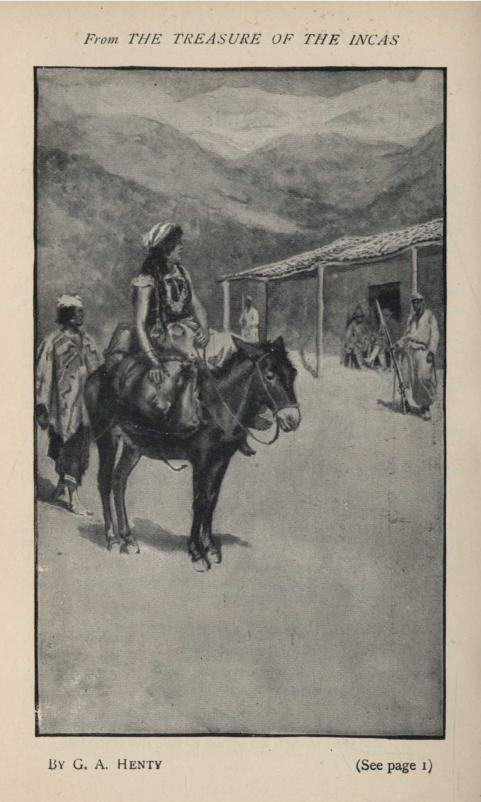
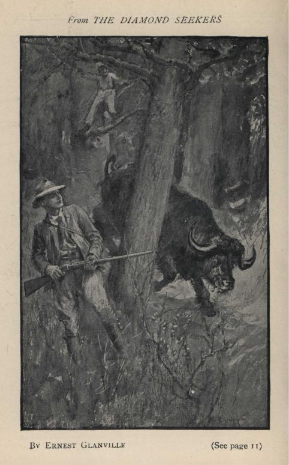
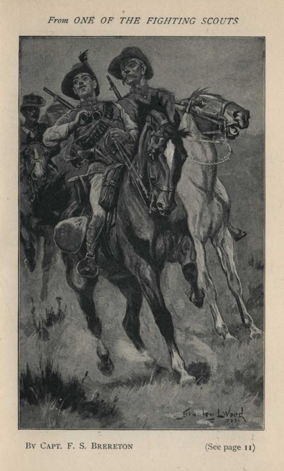
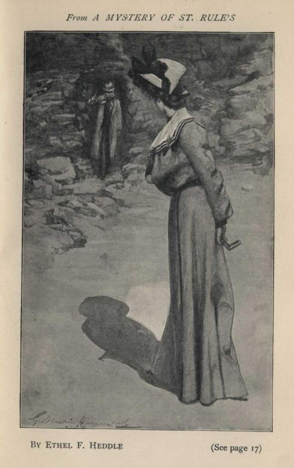
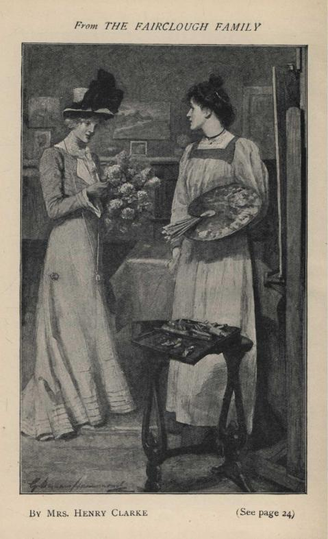
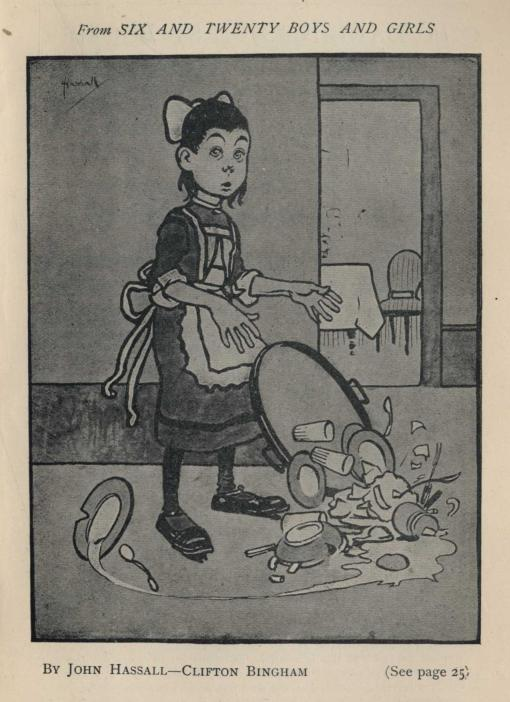
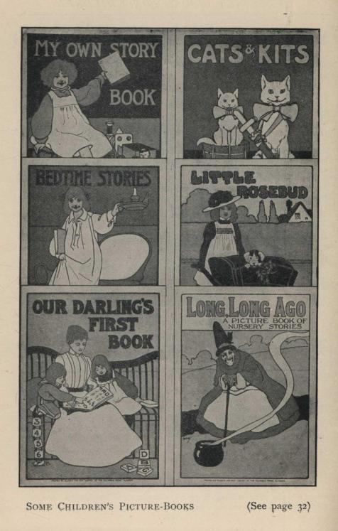

.. -*- encoding: utf-8 -*-

.. meta::
   :PG.Id: 48619
   :PG.Title: Blackie & Son's Illustrated Story Books Catalogue, 1889
   :PG.Released: 2015-03-31
   :PG.Rights: Public Domain
   :PG.Producer: Al Haines
   :DC.Creator: Blackie & Son
   :DC.Title: Blackie & Son's Illustrated Story Books Catalogue, 1889
   :DC.Language: en
   :DC.Created: 1889
   :coverpage: images/img-cover.jpg

=======================================================
BLACKIE & SON'S ILLUSTRATED STORY BOOKS CATALOGUE, 1889
=======================================================

.. clearpage::

.. pgheader::

.. container:: titlepage center white-space-pre-line

   .. vspace:: 4

   .. class:: xx-large bold

      Blackie & Son's
      Illustrated Story Books

   .. class:: x-large

      1889

   .. vspace:: 4

.. class:: center bold

   *HISTORICAL TALES BY*

.. vspace:: 2

**G. A. HENTY**

.. vspace:: 1

**With Kitchener in the Soudan:**

.. vspace:: 1

A Tale of Atbara and Omdurman.

.. vspace:: 1

With 10 Illustrations by W. RAINEY, R.I., and 3 Maps.  6s.

.. vspace:: 1

In carrying out various special missions
with which he is entrusted the
hero displays so much dash and enterprise
that he soon attains an
exceptionally high rank for his age.
In all the operations he takes a
distinguished part, and adventure follows
so close on adventure that the
end of the story is reached all too soon.

.. vspace:: 1

..
   
   "Mr. Henty has collected a vast amount of information
   about the reconquest of
   the Soudan, and he succeeds in impressing it upon his
   reader's mind at the very time
   when he is interesting him most."--*Literary World*.

.. vspace:: 2

**With the British Legion:**

.. vspace:: 1

**A Story of the Carlist Wars.**

.. vspace:: 1

With 10 Illustrations by WAL PAGET.  6s.

.. vspace:: 1

The hero joins the British Legion,
which was raised by Sir de Lacy
Evans to support the cause of Queen Christina
and the infant Queen
Isabella, and as soon as he sets foot
on Spanish soil his adventures begin.
Arthur is one of Mr. Henty's most brilliant heroes,
and the tale of his
experiences is thrilling and breathless from first to last.

.. vspace:: 1

..

   "It is a rattling story told with verve and
   spirit."--*Pall Mall Gazette*.

.. vspace:: 2

**The Treasure of the Incas:**

.. vspace:: 1

**A Tale of Adventure in Peru.**

.. vspace:: 1

With 8 Illustrations by WAL PAGET, and a Map.  5s.

.. vspace:: 1

The heroes of this powerful story go to
Peru to look for the treasure
which the Incas hid when the Spaniards
invaded the country.  Their task
is both arduous and dangerous,
but though they are often disappointed,
their courage and perseverance are at last amply rewarded.

.. vspace:: 1

..

   "The interest never flags for one moment,
   and the story is told with
   vigour."--*World*.

.. vspace:: 2

.. class:: center

   (\1)

.. vspace:: 2

.. class:: center white-space-pre-line

   \*      \*      \*      \*      \*

.. vspace:: 1

.. figure:: images/img-002.jpg
   :figclass: white-space-pre-line
   :align: center
   :alt: *From WITH THE BRITISH LEGION* by G. A. Henty (See page 1)

   *From WITH THE BRITISH LEGION*
   by G. A. Henty (See page 1)

.. vspace:: 2

.. class:: center

   (\2)

.. vspace:: 2

.. class:: center white-space-pre-line

   \*      \*      \*      \*      \*

.. vspace:: 2

**G. A. HENTY**

.. vspace:: 1

**With Roberts to Pretoria:**

.. vspace:: 1

A Tale of the South African War.

.. vspace:: 1

With 12 Illustrations by WILLIAM RAINEY, R.I., and a Map.  6s.

.. vspace:: 2

The hero takes part in the series of battles
that end in the disaster at
Magersfontein, is captured and imprisoned
in the race-course at Pretoria,
but escapes in time to fight at Paardeberg
and march with the victorious
army to Bloemfontein.  He rides with
Colonel Mahon's column to the
relief of Mafeking, and accomplishes
the return journey with such despatch
as to be able to join in the triumphant advance to Pretoria.

.. vspace:: 1

..
   
   "In this story of the South African
   war Mr. Henty proves once more his
   incontestable pre-eminence as a writer for boys."--*Standard*.

.. vspace:: 2
   
**Both Sides the Border:**

.. vspace:: 1

A Tale of Hotspur and Glendower.

.. vspace:: 1

With 12 page Illustrations by RALPH PEACOCK.  6s.

.. vspace:: 1
  
The hero casts in his lot with the Percys,
and becomes esquire to Sir
Henry, the gallant Hotspur.
He is sent on several dangerous and important
missions in which he acquits himself with great valour.

.. vspace:: 1

..
   
   "With boys the story should rank among Mr. Henty's
   best."--*Standard*.
   
   "A vivid picture of that strange past ... when
   England and Scotland ... were
   torn by faction and civil war."--*Onward*.

.. vspace:: 2

**Through Russian Snows:**

.. vspace:: 1

or, Napoleon's Retreat from Moscow.

.. vspace:: 1

With 8 page Illustrations by W. H. OVEREND.  5s.

.. vspace:: 1

Julian Wyatt becomes, quite innocently,
mixed up with smugglers, who
carry him to France, and hand him over
as a prisoner to the French.
He subsequently regains his freedom by
joining Napoleon's army in the
campaign against Russia.

.. vspace:: 1

..
   
   "The story of the campaign is very
   graphically told."--*St. James's Gazette*.
   
   "One of Mr. Henty's best books, which will be
   hailed with joy by his many eager
   readers."--*Journal of Education*.
   
   "Is full of life and action."--*Journal of Education*.

.. vspace:: 2

**Out with Garibaldi:**

.. vspace:: 1

A Story of the Liberation of Italy.

.. vspace:: 1

With 8 page Illustrations by W. RAINEY, R.I., and two Maps.  5s.

.. vspace:: 1

Mr. Henty makes the liberation of Italy
by Garibaldi the groundwork of
an exciting tale of adventure.
The hero is an English lad who joins the
expedition and takes a prominent part
in the extraordinary series of operations
that ended in the fall of the Neapolitan kingdom.

.. vspace:: 1

..

   "A first-rate story of stirring deeds."--*Daily Chronicle*.
   
   "Full of hard fighting, gallant rescues,
   and narrow escapes."--*Graphic*.

.. vspace:: 2

.. class:: center

   (\3)

.. vspace:: 2

.. class:: center white-space-pre-line

   \*      \*      \*      \*      \*

.. vspace:: 1

**G. A. HENTY**

.. vspace:: 1

**At the Point of the Bayonet:**

.. vspace:: 1

A Tale of the Mahratta War.

.. vspace:: 1

With 12 Illustrations by WAL PAGET, and 2 Maps.  6s.

.. vspace:: 1

Harry Lindsay is carried off to the hills
and brought up as a Mahratta.
At the age of sixteen he becomes
an officer in the service of the Mahratta
prince at Poona, and afterwards receives
a commission in the army of
the East India Company.
His courage and enterprise are rewarded by
quick promotion, and at the end of the war
he sails for England, where
he succeeds in establishing his right to the family estates.

.. vspace:: 1

..
   
   "A brisk, dashing narrative."--*Bookman*.

.. vspace:: 2

**Under Wellington's Command:**

.. vspace:: 1

A Tale of the Peninsular War.

.. vspace:: 1

With 12 page Illustrations by WAL PAGET.  6s.

.. vspace:: 1

In this stirring romance Mr. Henty gives
us the further adventures of
Terence O'Connor, the hero of *With Moore
at Corunna*.  We are told
how, in alliance with a small force
of Spanish guerrillas, the gallant regiment
of Portuguese levies commanded by Terence
keeps the whole of the French
army in check at a critical period of the war,
rendering invaluable service
to the Iron Duke and his handful of British troops.

.. vspace:: 1
   
..

   "An admirable exposition of Mr. Henty's masterly
   method of combining instruction
   with amusement."--*World*.

.. vspace:: 2

**To Herat and Cabul:**

.. vspace:: 1

A Story of the First Afghan War.

.. vspace:: 1

With 8 full-page Illustrations by C. M. SHELDON, and Map.  5s.

.. vspace:: 1

The hero takes a distinguished part
in the defence of Herat, and subsequently
obtains invaluable information for the
British army during the first
Afghan war.  He is fortunately spared the
horrors of the retreat from
Cabul, and shares in the series of
operations by which that most disastrous
blunder was retrieved.

.. vspace:: 1

..
   
   "We can heartily commend it to boys, old and young."--*Spectator*.

.. vspace:: 2

**With Cochrane the Dauntless:**

.. vspace:: 1

A Tale of his Exploits.

.. vspace:: 1

With 12 page Illustrations by W. H. MARGETSON.  6s.

.. vspace:: 1

It would be hard to find, even in sensational fiction,
a more daring leader
than Lord Cochrane, or a career which supplies
so many thrilling exploits.
The manner in which, almost single-handed,
he scattered the French fleet
in the Basque Roads is one of the greatest
feats in English naval history.

.. vspace:: 1

..

   "As rousing and interesting a book as boys could
   wish for."--*Saturday Review*.
   
   "This tale we specially recommend."--*St. James's Gazette*.

.. vspace:: 2

.. class:: center

   (\4)

.. vspace:: 2

.. class:: center white-space-pre-line

   \*      \*      \*      \*      \*

.. vspace:: 1

**G. A. HENTY**

.. vspace:: 1

**Redskin and Cow-Boy:**

.. vspace:: 1

A Tale of the Western Plains

.. vspace:: 1

With 12 page Illustrations by ALFRED PEARSE.  6s.

.. vspace:: 1

Hugh Tunstall accompanies a frontiersman
on a hunting expedition on
the Plains, and then seeks employment as
a cow-boy on a cattle ranch.
His experiences during a "round up" present
in picturesque form the toilsome,
exciting, adventurous life of a cow-boy;
while the perils of a frontier
settlement are vividly set forth.
Subsequently, the hero joins a wagon-team,
and the interest is sustained in a fight with,
and capture of, brigands.

.. vspace:: 1

..
   
   "A strong interest of open-air life and movement pervades
   the whole book."--*Scotsman*.

.. vspace:: 2

**With Buller in Natal:**

.. vspace:: 1

or, A Born Leader.

.. vspace:: 1

With 10 page Illustrations by W. RAINEY, R.I., and a Map.  6s.

.. vspace:: 1

The heroic story of the relief of Ladysmith
forms the theme of one of the
most powerful romances that have come from Mr. Henty's pen.
When the war breaks out, the hero, Chris King,
and his friends band themselves
together under the title of the Maritzburg Scouts.
From first to last the boy
scouts are constantly engaged in perilous
and exciting enterprises, from
which they always emerge triumphant,
thanks to their own skill and courage,
and the dash and ingenuity of their leader.

.. vspace:: 1

..
   
   "Just the sort of book to inspire an enterprising
   boy."--*Army and Navy Gazette*.

.. vspace:: 2

**By England's Aid:**

.. vspace:: 1

or, The Freeing of the Netherlands (1585-1604).

.. vspace:: 1

With 10 page Illustrations by ALFRED PEARSE, and 4 Maps.  6s.

.. vspace:: 1

Two English lads go to Holland in the service
of one of "the fighting
Veres".  After many adventures one of the lads
finds himself on board a
Spanish ship at the defeat of the Armada,
and escapes from Spain only to
fall into the hands of the Corsairs.
He is successful, however, in getting
back to Spain, and regains his native country
after the capture of Cadiz.

.. vspace:: 1

..
   
   "Boys know and love Mr. Henty's books of adventure,
   and will welcome his tale
   of the freeing of the Netherlands."--*Athæneum*.

.. vspace:: 2

**Condemned as a Nihilist:**

.. vspace:: 1

A Story of Escape from Siberia.

.. vspace:: 1

With 8 page Illustrations by WAL PAGET.  5s.

.. vspace:: 1

Godfrey Bullen, a young Englishman resident
in St. Petersburg, becomes
involved in various political plots,
resulting in his seizure and exile to
Siberia.  After an unsuccessful attempt to escape,
he gives himself up to the
Russian authorities.  Eventually he escapes,
and reaches home, having
safely accomplished a perilous journey
which lasts nearly two years.

.. vspace:: 1
   
..

   "The escape from Siberia is well told and the
   description of prison life is very
   graphic."--*Academy*.

.. vspace:: 2

.. class:: center 

   (\5)

.. vspace:: 2

.. class:: center white-space-pre-line

   \*      \*      \*      \*      \*

.. vspace:: 1

   *From THE TREASURE OF THE INCAS*
   By G. A. HENTY (See page 1)

.. vspace:: 2

.. class:: center

   (\6)

.. vspace:: 2

.. class:: center white-space-pre-line

   \*      \*      \*      \*      \*

.. vspace:: 1

**G. A. HENTY**

.. vspace:: 1

**Maori and Settler:**

.. vspace:: 1

A Story of the New Zealand War

.. vspace:: 1

With 8 page Illustrations by ALFRED PEARSE.  5s.

.. vspace:: 1

The Renshaws lose their property and emigrate
to New Zealand.  Wilfrid,
a strong, self-reliant lad, is the
mainstay of the household.  The odds seem
hopelessly against the party,
but they succeed in establishing themselves
happily in one of the pleasantest
of the New Zealand valleys.

.. vspace:: 1

..
   
   "A book which all young people, but especially boys,
   will read with avidity."--*Athæneum*.

.. vspace:: 2

**Beric the Briton:**

.. vspace:: 1

A Story of the Roman Invasion of Britain

.. vspace:: 1

With 12 page Illustrations by W. PARKINSON.  6s.

.. vspace:: 1

Beric is a boy-chief of a British tribe
which takes a prominent part in
the insurrection under Boadicea:
and after the defeat of that heroic queen
he continues the struggle in the fen-country.
Ultimately Beric is defeated
and carried captive to Rome, where he succeeds
in saving a Christian man
by slaying a lion in the arena, and is
rewarded by being made the personal
protector of Nero.  Finally, he escapes
and returns to Britain, where he
becomes a wise ruler of his own people.

.. vspace:: 1
   
..

   "He is a hero of the most attractive kind....
   One of the most spirited and well-imagined
   stories Mr. Henty has written."--*Saturday Review*.
   
   "His conflict with a lion in the arena is a
   thrilling chapter."--*School Beard Chronicle*.
   
   "Full of every form of heroism and pluck."--*Christian World*.

.. vspace:: 2

**The Dash for Khartoum:**

.. vspace:: 1

A Tale of the Nile Expedition.

.. vspace:: 1

With 10 page Illustrations by JOHN SCHÖNBERG and J. NASH.  6s.

.. vspace:: 1

In the record of recent British history
there is no more captivating page
for boys than the story of the Nile campaign,
and the attempt to rescue
General Gordon.  For, in the difficulties
which the expedition encountered,
and in the perils which it overpassed,
are found all the excitement of
romance, as well as the fascination which
belongs to real events.

.. vspace:: 1

..
   
   "*The Dash for Khartoum* is your ideal boys' book."--*Tablet*.
   
   "It is literally true that the narrative never
   flags a moment."--*Academy*.
   
   "Thec Dash for Khartoum will be appreciated
   even by those who don't ordinarily
   care a dash for anything."--*Punch*.

.. vspace:: 2

**With Wolfe in Canada:**

.. vspace:: 1

or, The Winning of a Continent.

.. vspace:: 1

With 12 page Illustrations by GORDON BROWNE.  6s.

.. vspace:: 1

Mr. Henty tells the story of the struggle
between Britain and France for
supremacy on the North American continent.
The fall of Quebec decided
that the Anglo-Saxon race should predominate
in the New World; that
Britain, and not France, should take the
lead among the nations.

.. vspace:: 1

..
   
   "A moving tale of military exploit and thrilling
   adventure."--*Daily News*.

.. vspace:: 2

.. class:: center
   
   (\7)
   
.. vspace:: 2

.. class:: center white-space-pre-line

   \*      \*      \*      \*      \*

.. vspace:: 1

**G. A. HENTY**

.. vspace:: 1

**Held Fast for England:**

.. vspace:: 1
   
A Tale of the Siege of Gibraltar.

.. vspace:: 1
   
With 8 page Illustrations by GORDON BROWNE.  5s.

.. vspace:: 1

The story deals with one of the most memorable
sieges in history.  The
hero, a young Englishman resident in Gibraltar,
takes a brave and worthy
part in the long defence, and we learn with
what bravery, resourcefulness,
and tenacity the Rock was held for England.

.. vspace:: 1

..
   
   "There is no cessation of exciting incident
   throughout the story."--*Athæneum*.

.. vspace:: 3

**In the Irish Brigade:**

.. vspace:: 1

A Tale of War in Flanders and Spain.

.. vspace:: 1

With 12 page Illustrations by CHARLES M. SHELDON.  6s.

.. vspace:: 1

The hero is a young officer in the Irish Brigade,
which for many years
after the siege of Limerick formed the backbone
of the French army.  He
goes through many stirring adventures,
successfully carries out dangerous
missions in Spain, saves a large portion
of the French army at Oudenarde,
and even has the audacity to kidnap
the Prime Minister of England.

.. vspace:: 1

..
   
   A stirring book of military adventure."--*Scotsman*.

.. vspace:: 3

**At Agincourt:**

.. vspace:: 1

A Tale of the White Hoods of Paris.

.. vspace:: 1

With 12 page Illustrations by WAL PAGET.  6s.

.. vspace:: 1

Sir Eustace de Villeroy, in journeying
from Hampshire to his castle in
France, made young Guy Aylmer one of his escort.
Soon thereafter the
castle was attacked, and the English youth
displayed such valour that his
liege-lord made him commander of a special
mission to Paris.  This he
accomplished, returning in time to take part
in the campaign against the
French which ended in the glorious victory
for England at Agincourt.

.. vspace:: 1

..

   "Cannot fail to commend itself to boys of all
   ages."--*Manchester Courier*.

.. vspace:: 2

**A Final Reckoning:**

.. vspace:: 1

A Tale of Bush Life in Australia.

.. vspace:: 1

With 8 page Illustrations by W. B. WOLLEN.  5s.

.. vspace:: 1

The hero, a young Englishman, emigrates
to Australia, where he gets
employment as an officer in the mounted police.
A few years of active
work gain him promotion to a captaincy.
In that post he greatly distinguishes
himself, and finally leaves the service and
settles down as a squatter.

.. vspace:: 1

..
   
   "A stirring story capitally told."--*Guardian*.

.. vspace:: 2

.. class:: center

   (\8)

.. vspace:: 2

.. class:: center white-space-pre-line

   \*      \*      \*      \*      \*

.. vspace:: 1

.. class:: center x-large white-space-pre-line

**Blackie & Son's
Story Books for Boys**

.. vspace:: 2

**G. MANVILLE FENN**

.. vspace:: 1

**Dick o' the Fens:**

.. vspace:: 1

A Romance of the Great East Swamp.

.. vspace:: 1

With 12 page Illustrations by FRANK DADD.  6s.

.. vspace:: 1

Dick o' the Fens and Tom o' Grimsey are
the sons of a squire and a
farmer living in Lincolnshire.
Many sketches of their shooting and fishing
experiences are related, while the record
of the fenmen's stealthy resistance
to the great draining scheme is full
of keen interest.  The ambushes and
shots in the mist and dark, and the
long-baffled attempts to trace the
lurking foe, are described with Mr. Fenn's wonted skill.

.. vspace:: 1

..
   
   "Mr. Fenn has here very nearly attained perfection.
   Life in the Fens in the old
   ante-drainage days is admirably reproduced.
   We have not of late come across a
   historical fiction, whether intended for boys
   or for men, which deserves to be so
   heartily praised as regards plot, incidents, and spirit.
   It is its author's masterpiece
   as yet."--*Spectator*.

.. vspace:: 2

**Nat the Naturalist:**

.. vspace:: 1

A Boy's Adventures in the Eastern Seas.

.. vspace:: 1

With 8 page Pictures by GORDON BROWNE.  5s.

.. vspace:: 1

The boy Nat and his uncle go on a voyage
to the islands of the Eastern
seas to seek specimens in natural history,
and their adventures there are full
of interest and excitement.
The descriptions of Mr. Ebony, their black
comrade, and of the scenes of savage
life sparkle with genuine humour.

.. vspace:: 1

..
   
   "This book encourages independence of character,
   develops resource, and teaches
   a boy to keep his eyes open."--*Saturday Review*.

.. vspace:: 2

**The Golden Magnet:**

.. vspace:: 1

A Tale of the Land of the Incas.

.. vspace:: 1

With 12 page Illustrations by GORDON BROWNE.  3s.

.. vspace:: 1

The tale is of a romantic youth,
who leaves home to seek his fortune in
South America.  He is accompanied by a
faithful companion, who, in the
capacity both of comrade and henchman,
does true service, and shows the
dogged courage of an English lad during
their strange adventures.

.. vspace:: 1

..
   
   "There could be no more welcome present for a boy.
   There is not a dull page,
   and many will be read with breathless
   interest."--*Journal of Education*.

.. vspace:: 2

.. class:: center

   (\9)

.. vspace:: 2

.. class:: center white-space-pre-line

   \*      \*      \*      \*      \*

.. vspace:: 1

   *From THE DIAMOND SEEKERS*
   By ERNEST GLANVILLE (See page 11)

.. vspace:: 2

.. class:: center

   (\10)

.. vspace:: 2

.. class:: center white-space-pre-line

   \*      \*      \*      \*      \*

.. vspace:: 1

**Dr. GORDON STABLES, R.N.**

.. vspace:: 1

**In the Great White Land:**

.. vspace:: 1

A Tale of the Antarctic Ocean.

.. vspace:: 1

With 6 Illustrations by J. A. WALTON.  3s. 6d.

.. vspace:: 1

This is a most fascinating story from beginning to end.
It is a true
picture of what daring healthful British men
and boys can do, written by
an author whose name is a household word
wherever the English language
is spoken.  All is described with a master's hand,
and the plot is just such
as boys love.

.. vspace:: 1

..
   
   "The narrative goes with a swing and a dash from start
   to finish."--*Public Opinion*.

.. vspace:: 3

**ERNEST GLANVILLE**

.. vspace:: 1

**The Diamond Seekers:**

.. vspace:: 1

A Story of Adventure in South Africa.

.. vspace:: 1

With 8 Illustrations by WILLIAM RAINEY, R.I.  6s.

.. vspace:: 1

The discovery of the plan of the diamond mine,
the dangers incurred in
reaching the wild, remote spot in an armoured
wagon, and the many
incidents of farm and veldt life,
are vividly described by an author who
knows the country well.

.. vspace:: 1

..
   
   "We have seldom seen a better story for boys."--*Guardian*.

.. vspace:: 3

**Capt. F. S. BRERETON, R.A.M.C.**

.. vspace:: 1

**One of the Fighting Scouts:**

.. vspace:: 1

A Tale of Guerrilla Warfare in South Africa.

.. vspace:: 1

With 8 Illustrations by STANLEY L. WOOD, and a Map.  5s.

.. vspace:: 1

This story deals with the guerrilla aspect
of the Boer War, and shows
how George Ransome is compelled to leave
his father's farm and take
service with the British.  He is given
the command of a band of scouts
as a reward for gallantry, and with these
he punishes certain rebels for
a piece of rascality, and successfully
attacks Botha's commando.  Thanks
to his knowledge of the veldt he is of signal
service to his country, and
even outwits the redoubtable De Wet.

.. vspace:: 1

..
   
   "Altogether an unusually good story."--*Yorkshire Post*.

.. vspace:: 2

**Under the Spangled Banner:**

.. vspace:: 1

A Tale of the Spanish-American War.

.. vspace:: 1

With 8 Illustrations by PAUL HARDY.  5s.

.. vspace:: 1

Hal Marchant is in Cuba before the commencement
of hostilities.  A
Spaniard who has been frustrated in an attempt
to rob Hal's employer
attacks the hacienda and is defeated,
but turns the tables by denouncing
Hal as a spy.  The hero makes good
his escape from Santiago, and
afterwards fights for America both
on land and at sea.  The story gives a
vivid and at the same time accurate account
of this memorable struggle.

.. vspace:: 1

..
   
   "Just the kind of book that a boy would delight
   in."--*Schoolmaster*.

.. vspace:: 2

.. class:: center

   (\11)

.. vspace:: 2

.. class:: center white-space-pre-line

   \*      \*      \*      \*      \*

.. vspace:: 1

**FREDERICK HARRISON**

.. vspace:: 1

**The Boys of Wynport College.**

.. vspace:: 1

With 6 Illustrations by HAROLD COPPING.  3s.  *New Edition*.

.. vspace:: 1

The hero and his chums differ as widely
in character as in personal
appearance.  We have Patrick O'Fflahertie,
the good-natured Irish boy;
Jack Brookes, the irrepressible humorist;
Davie Jackson, the true-hearted
little lad, on whose haps and mishaps
the plot to a great extent turns;
and the hero himself, who finds in his
experiences at Wynport College
a wholesome corrective of a somewhat lax home training.

.. vspace:: 1

..
   
   "A book which no well-regulated school-boy should be
   without."--*Whitehall Review*.

.. vspace:: 3

**LÉON GOLSCHMANN**

.. vspace:: 1

**Boy Crusoes:**

.. vspace:: 1

A Story of the Siberian Forest.

.. vspace:: 1

Adapted from the Russian by LÉON GOLSCHMANN.

.. vspace:: 1

With 6 page Illustrations by J. FINNEMORE, R.I.  3s. 6d.

.. vspace:: 1

Two Russian lads are so deeply impressed
by reading Robinson Crusoe
that they run away from home.
They lose their way in a huge trackless
forest, and for two years are kept busy
hunting for food, fighting against
wolves and other enemies, and labouring
to increase their comforts, before
they are rescued.

.. vspace:: 1

..
   
   "This is a story after a boy's own heart."--*Nottingham Guardian*.

.. vspace:: 3

**MEREDITH FLETCHER**

.. vspace:: 1

Every Inch a Briton:

.. vspace:: 1

A School story

.. vspace:: 1

With 6 page Illustrations by SYDNEY COWELL.  3s. 6d.

.. vspace:: 1

This story is written from the point of view
of an ordinary boy, who gives
an animated account of a young public-schoolboy's life.
No moral is
drawn; yet the story indicates a kind
of training that goes to promote
veracity, endurance, and enterprise;
and of each of several of the characters
it might be truly said, he is worthy
to be called, "Every Inch a Briton".

.. vspace:: 1

..
  
   "In *Every Inch a Briton* Mr. Meredith Fletcher has
   scored a success."--*Manchester Guardian*.

.. vspace:: 3

**EDGAR PICKERING**

.. vspace:: 1

**In Press-Gang Days.**

.. vspace:: 1

With 4 illustrations by W. S. STACEY.  2s. 6d.  *New Edition*.

.. vspace:: 1

In this story Harry Waring is caught
by the Press-gang and carried on
board His Majesty's ship *Sandwich*.
He takes part in the mutiny of the
Nore, and shares in some hard fighting
on board the *Phoenix*.  He is with
Nelson, also, at the storming of Santa Cruz,
and the battle of the Nile.

.. vspace:: 1

..
   
   "It is of Marryat, that friend of our boyhood,
   we think as we read this delightful
   story; for it is not only a story of adventure,
   with incidents well-conceived and
   arranged, but the characters are interesting
   and well-distinguished."--*Academy*.

.. vspace:: 2

.. class:: center

   (\12)

.. vspace:: 2

.. class:: center white-space-pre-line

   \*      \*      \*      \*      \*

.. vspace:: 1

**FRED SMITH**

.. vspace:: 1

**The Boyhood of a Naturalist.**

.. vspace:: 1

With 6 page Illustrations.  3s. 6d.  *New Edition*.

.. vspace:: 1

Few lovers of Nature have given to the world
a series of recollections so
entertaining, so vigorous,
and so instinct with life as these delightful
reminiscences.  The author takes the reader with him
in the rambles in which he
spent the happiest hours of his boyhood,
a humble observer of the myriad
forms of life in field and copse, by stream and hedgerow.

.. vspace:: 1

..
   
   "We cannot too highly recommend the book to all
   readers."--*Guardian*.

.. vspace:: 2

**The World of Animal Life.**

.. vspace:: 1

Edited by Fred Smith.  Profusely Illustrated with
Engravings after F. SPECHT and other
eminent artists.  5s.

.. vspace:: 1

The aim of *The World of Animal Life*
is to give in non-scientific language an account of
those inhabitants of the land, sea, and sky with whose
names we are all familiar, but concerning
whose manner of life the majority
of us have only the haziest conceptions.

.. vspace:: 1

..

   "An admirable volume for the young mind enquiring after
   Nature.--*Birmingham Gazette*.

.. vspace:: 3

**EDGAR PICKERING**

.. vspace:: 1

*An Old-Time Yarn:**

.. vspace:: 1

Adventures in the West Indies
and Mexico with Hawkins and Drake.

.. vspace:: 1

With 6 page Illustrations by ALFRED PEARSE.  3s. 6d.

.. vspace:: 1

The hero sails from Plymouth in the flagship
of Master John Hawkins.
Divers are the perils through which he passes.
Chief of these are the
destruction of the English ships by the
treacherous Spaniards, the fight
round the burning vessels, the journey
of the prisoners to the city of Mexico,
the horrors of the Inquisition,
and the final escape to England.

.. vspace:: 1

..
   
   "An excellent story of adventure....  The book is thoroughly
   to be recommended."--*Guardian*.

.. vspace:: 3

**CLIVE PHILLIPPS-WOLLEY**

.. vspace:: 1

**Gold, Gold in Cariboo:**

.. vspace:: 1

A Story of Adventure in British Columbia.

.. vspace:: 1

With 4 Illustrations by G. C. HINDLEY.  1s. 6d.  *New Edition*.

.. vspace:: 1

Ned Corbett, a young Englishman,
and his companion set out with
a pack-train in order to obtain gold
on the upper reaches of the Fraser
River.  After innumerable adventures,
and a life-and-death struggle with
the Arctic weather of that wild region,
they find the secret gold-mines for
which they have toilsomely searched.

.. vspace:: 1

..
   
   "It would be difficult to say too much in favour
   of *Gold, Gold in Cariboo*.  We
   have seldom read a more exciting tale
   of wild mining adventure in a singularly
   inaccessible country.  There is a capital plot,
   and the interest is sustained to the
   last page."--*The Times*.

.. vspace:: 2

.. class:: center

   (\13)

.. vspace:: 2

.. class:: center white-space-pre-line

   \*      \*      \*      \*      \*

.. vspace:: 1

**ROBERT LEIGHTON**

.. vspace:: 1

**The Golden Galleon.**

.. vspace:: 1

With 6 Illustrations by W. RAINEY, R.I.  3s.  *New Edition*.

.. vspace:: 1

Gilbert Oglander, and his friend,
Timothy Trollope, join in Lord
Thomas Howard's expedition to intercept
the Spanish treasure-fleet from
the West Indies, and are on board
*The Revenge* in the memorable fight
between that one little man-of-war and
fifty-three great galleons of Spain.
After the battle come storm and shipwreck,
and the lads, having drifted
for days, find refuge on board a derelict galleon,
whence they are rescued
and brought home to England.

.. vspace:: 1

..
   
   "A well-constructed and lively historical romance."--*Spectator*.

.. vspace:: 3

**S. BARING-GOULD**

.. vspace:: 1

**Grettir the Outlaw:**

.. vspace:: 1

A Story of Iceland in the days of the Vikings.

.. vspace:: 1

With 6 page Illustrations by M. ZENO DIEMER.  3s.

.. vspace:: 1

A narrative of adventure of the most romantic kind.
No boy will be able
to withstand the magic of such scenes
as the fight of Grettir with the twelve
bearserks, the wrestle with Karr the Old
in the chamber of the dead, the
combat with the spirit of Glam the thrall,
and the defence of the dying
Grettir by his younger brother.

.. vspace:: 1

..
   
   "Has a freshness, a freedom, a sense of sun
   and wind and the open air, which make
   it irresistible."--*National Observer*.

.. vspace:: 3

**C. J. CUTCLIFFE HYNE**

.. vspace:: 1

**The Captured Cruiser:**

.. vspace:: 1

or, Two Years from Land.

.. vspace:: 1

With 6 page Illustrations by F. BRANGWYN.  3s. 6d.

.. vspace:: 1

The central incidents deal with the capture,
during the war between Chili
and Peru, of an armed cruiser.
The heroes and their companions break
from prison in Valparaiso, board this warship
in the night, overpower the
watch, escape to sea under the fire of the forts,
and finally, after marvellous
adventures, lose the cruiser among the icebergs near Cape Horn.

.. vspace:: 1

..
   
   "The two lads and the two skippers are admirably drawn.
   Mr. Hyne has now
   secured a position in the first rank of writers of
   fiction for boys."--*Spectator*.

.. vspace:: 2

**Stimson's Reef:**

.. vspace:: 1

With 4 page illustrations by W. S. STACEY.  2s. 6d.

.. vspace:: 1

This is the extended log of a cutter which
sailed from the Clyde to the
Amazon in search of a gold reef.
It relates how they discovered the
buccaneer's treasure in the Spanish Main,
fought the Indians, turned aside
the river Jamary by blasting,
and so laid bare the gold of Stimson's Reef.

.. vspace:: 1

..
   
   "Few stories come within hailing distance
   of *Stimson's Reef* in startling incidents
   and hairbreadth escapes.
   It may almost vie with Mr. R. L. Stevenson's *Treasure
   Island*."--*Guardian*.

.. vspace:: 2

.. class:: center

   (\14)

.. vspace:: 2

.. class:: center white-space-pre-line

   \*      \*      \*      \*      \*

.. vspace:: 1

   *From ONE OF THE FIGHTING SCOUTS*
   BY CAPT. F. S. BRERETON. (See page 11)

.. vspace:: 2

.. class:: center

   (\15)

.. vspace:: 2

.. class:: center white-space-pre-line

   \*      \*      \*      \*      \*

.. vspace:: 1

**R. STEAD**

.. vspace:: 1

**Grit Will Tell:**

.. vspace:: 1

The Adventures of a Barge-boy.

.. vspace:: 1

With 4 Illustrations by D. CARLETON SMYTH.  Cloth, 2s. 6d.

.. vspace:: 1

A lad whose name has been lost amidst
early buffetings by hard fortune
suffers many hardships at the hands of a bargeman,
his master, and runs
away.  The various adventures and experiences
with which he meets on
the road to success, the bear-hunt
in which he takes part, and the battle
at which he acts as war correspondent,
form a story of absorbing interest
and after a boy's own heart.

.. vspace:: 1

..

   "A thoroughly wholesome and attractive book."--*Graphic*.

.. vspace:: 3

**HARRY COLLINGWOOD**

.. vspace:: 1

**The Pirate Island.**

.. vspace:: 1

With 6 page Illustrations by C. J. STANILAND and J. R. WELLS.
3s.  *New Edition*.

.. vspace:: 1

By a deed of true gallantry the hero's
whole destiny is charmed, and, going
to sea, he forms one of a party who,
after being burned out of their ship in
the South Pacific, are picked up by a pirate
brig and taken to the "Pirate
Island".  After many thrilling adventures,
they ultimately succeed in
effecting their escape.

.. vspace:: 1

..
   
   "A capital story of the sea; indeed in our opinion
   the author is superior in some
   respects as a marine novelist to the
   better-known Mr. Clark Russell."--*Times*.

.. vspace:: 3

**FLORENCE COOMBE**

.. vspace:: 1

**Boys of the Priory School.**

.. vspace:: 1

With 4 page Illustrations by HAROLD COPPING.  2s. 6d.

.. vspace:: 1

The interest centres in the relations of
Raymond and Hal Wentworth,
and the process by which Raymond,
the hero of the school, learns that in
the person of his ridiculed cousin there
beats a heart more heroic than his own.

.. vspace:: 1

..
   
   "It is an excellent work of its class, cleverly
   illustrated with 'real boys' by Mr. Harold Copping."--*Literature*.

.. vspace:: 3

**JOHN C. HUTCHESON**

.. vspace:: 1

**Afloat at Last:**

.. vspace:: 1

A Sailor Boy's Log

.. vspace:: 1

With 6 Page Illustrations by W. H. OVEREND.  3s. 6d.

.. vspace:: 1

From the stowing of the vessel in the Thames
to her recovery from the
Pratas Reef on which she is stranded,
everything is described with the
accuracy of perfect practical knowledge
of ships and sailors; and the incidents
of the story range from the broad humours
of the fo'c's'le to the perils
of flight from, and fight with,
the pirates of the China Seas.

.. vspace:: 1

..

   "As healthy and breezy a book as one could wish."--*Academy*.

.. vspace:: 2

.. class:: center

   (\16)

.. vspace:: 2

.. class:: center white-space-pre-line

   \*      \*      \*      \*      \*

.. vspace:: 2

.. class:: center x-large bold white-space-pre-line

   Blackie & Son's
   Story Books for Girls

.. vspace:: 2

**ETHEL F. HEDDLE**

.. vspace:: 1

**A Mystery of St. Rule's.**

.. vspace:: 1

With 8 Illustrations by G. DEMAIN HAMMOND, R.I.  6s.
*Illustrated Edition*.

.. vspace:: 1

..

   "The author has been amazingly successful
   in keeping her secret almost to the
   end.  Yet the mystery attending a stolen diamond
   of great value is so skilfully
   handled that several perfectly innocent persons
   seem all but hopelessly identified
   with the disappearance of the gem.
   Cleverly, however, as this aspect of the story
   has been managed, it has other sources of strength."--*Scotsman*.
   
   "The chief interest ... lies in the fascinating
   young adventuress, who finds
   a temporary nest in the old professor's family,
   and wins all hearts in St. Rules by
   her beauty and her sweetness."--*Morning Leader*.
   
   "Into the dignified atmosphere of a northerly
   academic town, Miss Ethel Heddle
   introduces a coil of events worthy of Wilkie
   Collins."--*Manchester Guardian*.

.. vspace:: 3

**KATHARINE TYNAN**

.. vspace:: 1

Girl of Galway.

.. vspace:: 1

With 8 full-page Illustrations by JOHN H. BACON.  6s.

.. vspace:: 1

When Bertha Grace is on the threshold
of young womanhood, she goes
to stay with her grandfather in Ireland,
with the trust from her mother of
reconciling him and his son, Bertha's father.
Bertha finds her grandfather
a recluse and a miser, and in the hands of an underling,
who is his evil genius.  How she keeps faith
with her mother and finds her own fate,
through many strange adventures, is the subject of the story.

.. vspace:: 1

..

   "Full of the poetic charm we are accustomed
   to find in the works of that gifted writer."--*World*.

.. vspace:: 3

**CAROLINE AUSTIN**

.. vspace:: 1

**Cousin Geoffrey and I.**

.. vspace:: 1

With 6 full-page Illustrations by W. PARKINSON.  3s.

.. vspace:: 1

The only daughter of a country gentleman
finds herself unprovided for at
her father's death, and for some time lives
as a dependant upon her kinsman.
Life is saved from being unbearable to her by her young cousin
Geoffrey, who at length meets with a
serious accident for which she is held
responsible.  She makes a brave attempt
to earn her own livelihood, until
a startling event brings her cousin
Geoffrey and herself together again.

.. vspace:: 1

..

   "Miss Austin's story is bright, clever, and
   well developed."--*Saturday Review*.

.. vspace:: 2

.. class:: center

   (\17)

.. vspace:: 2

.. class:: center white-space-pre-line

   \*      \*      \*      \*      \*

.. vspace:: 1

**ELLINOR DAVENPORT ADAMS**

.. vspace:: 1

**A Queen among Girls.**

.. vspace:: 1

With 6 Illustrations by HAROLD COPPING.  Cloth, 3s. 6d.

.. vspace:: 1

Augusta Pembroke is the head of her school,
the favourite of her teachers
and fellow-pupils, who are attracted
by her fearless and independent nature
and her queenly bearing.
She dreams of a distinguished professional
career; but the course of her life
is changed suddenly by pity for her
timid little brother Adrian,
the victim of his guardian-uncle's harshness.
The story describes the daring means adopted
by Augusta for Adrian's relief.

.. vspace:: 1

..

   "An interesting and well-written narrative,
   in which humour and a keen eye for
   character unite to produce a book happily
   adapted for modern maidens."--*Globe*.

.. vspace:: 2

**A Girl of To-Day.**

.. vspace:: 1

With 6 page Illustrations by G. D. HAMMOND, R.I.  3s. 6d.

.. vspace:: 1

"What are Altruists?" humbly asks a small boy.
"They are only people
who try to help others," replies the Girl
of To-Day.  To help their poorer
neighbours, the boys and girls of Woodend
band themselves together into
the Society of Altruists.
That they have plenty of fun is seen in the
shopping expedition and in the successful
Christmas entertainment.

.. vspace:: 1

..
   
   "It is a spirited story.  The characters are true
   to nature and carefully developed.
   Such a book as this is exactly what is needed
   to give a school-girl an interest in the
   development of character."--*Educational Times*.

.. vspace:: 3

**FRANCES ARMSTRONG**

.. vspace:: 1

**A Girl's Loyalty.**

.. vspace:: 1

With 6 Illustrations by JOHN H. BACON.  Cloth, 3s. 6d.
*New Edition*.

.. vspace:: 1

When she was still but a child, Helen Grant
received from her grandfather,
on his death-bed, a secret message.
The brief words remained
fast in her memory, and dominated her whole career.
She was loyal to
her trust, however, and to her friends
in the hour of their need.  For the
girl was possessed of that quick courage
which leaps up in a shy nature
when evil-doers have to be unmasked, and wrongs made right.

.. vspace:: 1

..

   "The one book for girls that stands out this year
   is Miss Frances Armstrong's
   *A Girl's Loyalty*."--*Review of Reviews*.

.. vspace:: 3

**G. NORWAY**

.. vspace:: 1

**A True Cornish Maid.**

.. vspace:: 1

With 6 page Illustrations by J. FINNEMORE.  3s. 6d.

.. vspace:: 1

The heroine of the tale is sister
to a young fellow who gets into trouble
in landing a contraband cargo on the
Cornish coast.  In his extremity the
girl stands by her brother bravely,
and by means of her daring scheme he
manages to escape.

.. vspace:: 1

..

   "The success of the year has fallen, we think,
   to Mrs. Norway, whose *True
   Cornish Maid* is really an admirable piece
   of work."--*Review of Reviews*.

.. vspace:: 2

.. class:: center

   (\18)

.. vspace:: 2

.. class:: center white-space-pre-line

   \*      \*      \*      \*      \*

.. vspace:: 1

   *From A MYSTERY OF ST. RULE'S*
   By ETHEL F. HEDDLE.  (See page 17)

.. vspace:: 2

.. class:: center

   (\19)

.. vspace:: 2

.. class:: center white-space-pre-line

   \*      \*      \*      \*      \*

.. vspace:: 1

**ROSA MULHOLLAND** (LADY GILBERT)

.. vspace:: 1

**The Girls of Banshee Castle.**

.. vspace:: 1

With 6 Illustrations by JOHN H. BACON.  Cloth, 3s. 6d.
*New Edition*.

.. vspace:: 1

Three girls, with an old governess,
migrate from Kensington to the
West of Ireland.  Belonging as they do
to "the ould family", the girls
are made heartily welcome in the cabins
of the peasantry, where they
learn many weird and curious tales from
the folk-lore of the district.  An
interesting plot runs through the narrative,
but the charm of the story lies
in its happy mingling of Irish humour and pathos.

.. vspace:: 1

..

   "Is told with grace, and brightened by a
   knowledge of Irish folk-lore, making it
   a perfect present for a girl in her teens."--*Truth*.

.. vspace:: 2

**Gianetta:**

.. vspace:: 1

A Girl's Story of Herself.

.. vspace:: 1

With 6 full-page illustrations by LOCKHART BOGLE.  3s.

.. vspace:: 1

The story of a changeling who is suddenly
transferred to the position of
a rich English heiress.
She develops into a good and accomplished woman,
and has gained too much love and devotion
to be a sufferer by the surrender
of her estates.

.. vspace:: 3

**ANNIE E. ARMSTRONG**

.. vspace:: 1

Violet Vereker's Vanity.

.. vspace:: 1

With 6 full-page Illustrations by G. DEMAIN HAMMOND, R.I.  3s. 6d.

.. vspace:: 1

The heroine was an excellent girl in most respects.
But she had one
small weakness, which expressed itself
in a snobbish dislike of her neighbours,
the Sugdens, whose social position
she deemed beneath her own.  In
the end, however, the girl acknowledged her folly,
with results which are
sure to delight the reader.

.. vspace:: 1

..

   "A book for girls that we can heartily recommend,
   for it is bright, sensible, and
   with a right tone of thought and feeling."--*Sheffield Independent*.

.. vspace:: 3

**ALICE CORKRAN**

.. vspace:: 1

**Margery Merton's Girlhood.**

.. vspace:: 1

With 6 full-page Illustrations by GORDON BROWNE.  3s. 6d.

.. vspace:: 1

The experiences of an orphan girl who
in infancy is left by her father--an
officer in India--to the care of an elderly
aunt residing near Paris.  The
accounts of the various persons who have
an after influence on the story are
singularly vivid.

.. vspace:: 1

..

   "*Margery Merton's Girlhood* is a piece of true literature,
   as dainty as it is delicate,
   and as sweet as it is simple."--*Woman's World*.

.. vspace:: 2

.. class:: center

   (\20)

.. vspace:: 2

.. class:: center white-space-pre-line

   \*      \*      \*      \*      \*

.. vspace:: 1

**ELIZA F. POLLARD**

.. vspace:: 1

**For the Red Rose.**

.. vspace:: 1

With 4 Illustrations by JAMES DURDEN.  2s. 6d.

.. vspace:: 1

A gipsy finds a little girl in the forest of Wimbourne,
after the sacking
of the castle by the Yorkists.
He carries her to the camp and she is
adopted by the tribe.  The story tells how,
when some years later Margaret
of Anjou and her son are wrecked on the coast
of England, the gipsy
girl follows the fortunes of the exiled queen,
and by what curious chain of
events her own origin is discovered.

.. vspace:: 1

..

   "This is a good story, and of special interest
   to lovers of historical romance."--*Court Circular*.

.. vspace:: 3

**MRS. E. J. LYSAGHT**

.. vspace:: 1

**Brother and Sister:**

.. vspace:: 1

With 6 page Illustrations by GORDON BROWNE.  3s. 6d.

.. vspace:: 1

A story showing, by the narrative of the
vicissitudes and struggles of a
family which has "come down in the world",
and of the brave endeavours
of its two younger members, how the pressure
of adversity is mitigated by
domestic affection, mutual confidence,
and hopeful honest effort.

.. vspace:: 1

..

   "A pretty story, and well told.  The plot is cleverly
   constructed, and the moral is excellent."--*Athæneum*.

.. vspace:: 3

**ANNE BEALE**

.. vspace:: 1

**The Heiress of Courtleroy.**

.. vspace:: 1

With 8 full-page Illustrations by T. C. H. CASTLE.  5s.

.. vspace:: 1

Mimica, the heroine, comes to England
as an orphan, and is coldly
received by her uncle.  The girl has a
brave nature, however, and succeeds
in saving the estate from ruin and
in reclaiming her uncle from the misanthropical
disregard of his duties as a landlord.

.. vspace:: 1

..

   "One of the very best of girl's books we have
   seen."--*Sheffield Telegraph*.

.. vspace:: 3

**SARAH TYTLER**

.. vspace:: 1

**A Loyal Little Maid.**

.. vspace:: 1

With 4 page Illustrations by PAUL HARDY.  2s. 6d.

.. vspace:: 1

This pretty story is founded on a romantic
episode of Mar's rebellion.
A little girl has information which concerns
the safety of her father in hiding,
and this she firmly refuses to divulge
to a king's officer.  She is lodged
in the Tolbooth, where she finds a boy champion,
whom in future years she
rescues in Paris from the *lettre de cachet*
which would bury him in the Bastille.

.. vspace:: 1

..

   "Has evidently been a pleasure to write,
   and makes very enjoyable reading."--*Literature*.

.. vspace:: 2

.. class:: center

   (\21)

.. vspace:: 2

.. class:: center white-space-pre-line

   \*      \*      \*      \*      \*

.. vspace:: 1

   *From THE FAIRCLOUGH FAMILY*
   By MRS. HENRY CLARKE.  (See page 24)

.. vspace:: 2

.. class:: center

   (\22)

.. vspace:: 2

.. class:: center white-space-pre-line

   \*      \*      \*      \*      \*

.. vspace:: 1

**GERALDINE MOCKLER**

.. vspace:: 1

**The Four Miss Whittingtons:**

.. vspace:: 1

A Story for Girls.

.. vspace:: 1

With 8 full-page Illustrations by CHARLES M. SHELDON.  5s.

.. vspace:: 1

This story tolls how four sisters,
left alone in the world, went to London
to seek their fortunes.  They had between them £400,
and this they resolved to spend on training themselves
for the different careers for which
they were severally most fitted.
On their limited means this was hard
work, but their courageous experiment
was on the whole very successful.

.. vspace:: 1

..

   "A story of endeavour, industry, and independence
   of spirit."--*World*.

.. vspace:: 3

**ALICE STRONACH**

.. vspace:: 1

**A Newnham Friendship.**

.. vspace:: 1

With 6 full-page Illustrations by HAROLD COPPING.  3s. 6d.

.. vspace:: 1

A sympathetic description of life at Newnham College.
After the tripos
excitements, some of the students leave
their dream-world of study and
talk of "cocoas" and debates and athletics
to begin their work in the real
world.  Men students play their part
in the story, and in the closing
chapters it is suggested that marriage
has its place in a girl graduate's life.

.. vspace:: 1

..

   "Foremost among all the gift-books suitable
   for school-girls this season stands Miss
   Alice Stronach's *A Newnham Friendship*."--*Daily Graphic*.

.. vspace:: 3

**BESSIE MARCHANT**

.. vspace:: 1

**The Secret of the Everglades.**

.. vspace:: 1

With 4 Illustrations by A. A. DIXON.  2s. 6d.

.. vspace:: 1

The father of the Osneys is supposed
to have been killed whilst trapping
in the Everglades of Florida.
The family organize a series of expeditions
to search for their father; but the
secret of the swamp is hard to solve,
and the end of the book is reached before
the mystery is made clear.

.. vspace:: 1

..

   "A fresh and original story of incident and
   adventure in the mysterious Florida
   swamps.  An excellent and engrossing
   story."--*St. James's Gazette*.

.. vspace:: 2

**Three Girls on a Ranch:**

.. vspace:: 1

A Story of New Mexico.

.. vspace:: 1

With 4 page Illustrations by W. E. WEBSTER.  2s. 6d.

.. vspace:: 1

The Lovell family emigrate from England
to New Mexico, where they
settle on a ranch.  Mr. Lovell is delicate
and unfit for farming, but the
three eldest girls take upon themselves
the burden of working the ranch.
They have adventures of a perilous kind,
and the story of their mishaps
and how they overcame them is throughout
both exciting and stimulating.

.. vspace:: 1

..

   "A story with a fresh, bright theme, well
   handled."--*Nottingham Guardian*.
   
   "A rousing book for young people."--*Queen*.

.. vspace:: 2

.. class:: center

   (\23)

.. vspace:: 2

.. class:: center white-space-pre-line

   \*      \*      \*      \*      \*

.. vspace:: 1

**MRS. HENRY CLARKE**

.. vspace:: 1

**The Fairclough Family.**

.. vspace:: 1

With 6 Illustrations by G. D. HAMMOND, R.I.  Cloth, 3s. 6d.

.. vspace:: 1

It was matter for amazement when Ronald
Hammersley fell in love
with Kathy Fairclough, who was considered
a blue-stocking, instead of
with her younger sister Nell,
whom Mrs. Hammersley had chosen for
him.  Why Mrs. Hammersley desired her
wealthy stepson to marry one
of Dr. Fairclough's penniless daughters was a secret.
How the secret
became known, and nearly wrecked the happiness
of Kathy and Ronald,
is told in the story.  But all ends well,
and to the sound of marriage bells.

.. vspace:: 1

..

   "One of those stories which all girls enjoy."--*World*.

.. vspace:: 3

**J. M. CALLWELL**

.. vspace:: 1

**A Little Irish Girl.**

.. vspace:: 1

Illustrated by H. COPPING.  2s. 6s.

.. vspace:: 1

An orphaned family inherit a small property
on the coast of Clare.  The
two youngest members of the party have some
thrilling adventures in their
western home.  They encounter seals,
smugglers, and a ghost, and lastly,
by most startling means, they succeed
in restoring their eldest brother to
his rightful place as heir to the ancestral estates.

.. vspace:: 1

..

   "Sure to prove of thrilling interest to both
   boys and girls."--*Literary World*.

.. vspace:: 3

**\E. EVERETT-GREEN**

.. vspace:: 1

**Miriam's Ambition.**

.. vspace:: 1

With Illustrations.  2s. 6d.

.. vspace:: 1

Miriam's ambition is to make someone happy,
and her endeavour carries
with it a train of incident, solving
a mystery which had thrown a shadow
over several lives.  A charming foil
to her grave elder sister is to be found
in Miss Babs, a small coquette of five,
whose humorous child-talk is so
attractive.

.. vspace:: 1

..

   "Miss Everett-Green's children are
   real British boys and girls, not small men
   and women.  Babs is a charming little one."--*Liverpool Mercury*.

.. vspace:: 3

**EMMA LESLIE**

.. vspace:: 1

**Gytha's Message**

.. vspace:: 1

A Tale of Saxon England.

.. vspace:: 1

With Illustrations.  2s. 6d.

.. vspace:: 1

We get a glimpse of the stirring events
taking place at that period; and
both boys and girls will delight to read
of the home life of Hilda and
Gytha, and of the brave deeds of the
impulsive Gurth and the faithful
Leofric.

.. vspace:: 1

..

   "This is a charmingly told story.
   It is the sort of book that all girls and some
   boys like, and can only get good from."--*Journal of Education*.

.. vspace:: 2

.. class:: center

   (\24)

.. vspace:: 2

.. class:: center white-space-pre-line

   \*      \*      \*      \*      \*

.. vspace:: 1

.. class:: center x-large bold white-space-pre-line

   Blackie & Son's
   Finely Illustrated Books for
   Children

.. vspace:: 2

**STEWART ORR--JOHN BRYMER**

.. vspace:: 1

**Two Merry Mariners.**

.. vspace:: 1

Pictures by STEWART ORR;
Verses by JOHN BRYMER.  Cover design and
24 pages in full colour.  Picture
boards, cloth back, 6s.

.. vspace:: 1

This delightful volume tells in picture
and verse how Dick and his
friend the Hare sailed to the Downy Isle,
the adventures they met with in
that strange country, their encounter
with the Dragon, and their remarkable
voyage home.  Mr. Orr exhibits
in these designs a rare combination
of humorous invention with brilliant
draughtsmanship and command of
colour, and the author supports
him with a series of racy verses.

.. vspace:: 1

..

   "The illustrations are masterpieces of
   drollery."--*Manchester Courier*.
   
   "The verses are very funny and original."--*World*.

.. vspace:: 3

**JOHN HASSALL--CLIFTON BINGHAM**

.. vspace:: 1

**Six and Twenty Boys and Girls.**

.. vspace:: 1

Pictures by JOHN HASSALL; Verses by CLIFTON BINGHAM.
25 pages in full colour,
and 24 pages of letterpress.
Picture boards, 9 inches by 11-1/4
inches, cloth back, 3s. 6d.; also cloth elegant, 5s.

.. vspace:: 1

Most of us know some at least of the
little girls and boys portrayed by
Mr. Hassall in this amusing picture-book.
As depicted with Mr. Hassall's
inimitable skill, and described
in humorous verse by Mr. Bingham, they
may challenge comparison with the
classic Struwwelpeter.  Each picture
is not only attractive and amusing in itself,
but furnishes a hint of virtues
to be imitated or faults to be avoided.

.. vspace:: 1

..

   "Exactly hits the mark."--*Scotsman*.
   
   "A most original picture-book."--*World*.

.. vspace:: 3

**MRS. PERCY DEARMER**

.. vspace:: 1

**Roundabout Rhymes.**

.. vspace:: 1

With 20 full-page Illustrations in colour by
Mrs. PERCY DEARMER.  Imperial 8vo, cloth extra, 2s. 6d.

.. vspace:: 1

A charming volume of verses and colour
pictures for little folk--rhymes
and pictures about most of the
everyday events of nursery life.

.. vspace:: 1

..

   "The best verses written for children
   since Stevenson's *Child's Garden*."--*The Guardian*.

.. vspace:: 2

.. class:: center

   (\25)

.. vspace:: 2

.. class:: center white-space-pre-line

   \*      \*      \*      \*      \*

.. vspace:: 1

**STEWART ORR--JOHN BRYMER**

.. vspace:: 1

**Gammon and Spinach:**

.. vspace:: 1

Pictures by STEWART ORR.  Verses by JOHN
BRYMER.  Cover design and 24 pages in Full Colour.
Picture boards, cloth back, 6s.

.. vspace:: 1

In *Gammon and Spinach* Mr. Stewart Orr
has produced a picture-book
unique of its kind.  Nothing could be more
droll than the situations in
which he represents the frog, the pig,
the mouse, the elephant, and the
other well-known characters who appear
in his pages.  Little folk will
find in these pictures a source of endless
delight, and the artistic skill
which they display will have a special
appeal to children of an older
growth.

.. vspace:: 1

..

   "Merry and handsome enough to make thousands
   of friends among little folk,
   what with its original verses and its amusing
   pictures."--*Literary World*.
   
   "The book should attain a wide popularity
   in the nursery."--*Morning Post*.

.. vspace:: 3

**\H. \B. NEILSON--JOHN BRYMER**

.. vspace:: 1

**Games and Gambols.**

.. vspace:: 1

Illustrated by HARRY B. NEILSON; with Verses by
JOHN BRYMER.  26 pages in colour,
and 24 pages of letterpress.
Picture boards, 9 inches by 11-1/4 inches,
cloth back, 2s. 6d.; also
cloth elegant, 3s. 6d.

.. vspace:: 1

Mr. Neilson surpasses himself in these
irresistible colour pictures representing
the animal world at play.
The great test match between the Lions
and the Kangaroos, Mrs. Mouse's Ping-Pong Party,
Mr. Bruin playing
Golf, Towser's Bicycle Tour, and the Kittens *v.*
Bunnies Football Match,
are a few among the many droll subjects
illustrated in this amusing and
original series.

.. vspace:: 1

..

   "Mr. Neilson has a positive genius for
   making animals comic."--*Academy*.
   
   Children will revel in his work."--*Daily Graphic*.

.. vspace:: 3

**FRED SMITH**

.. vspace:: 1

**The Animal Book.**

.. vspace:: 1

A Natural History for Little Folk.

.. vspace:: 1

With a Coloured Frontispiece and 34 full-page
Illustrations by F. SPECHT.  Crown quarto,
11-1/4 inches by 9-1/2 inches, picture boards,
cloth back, 2s. 6d.

.. vspace:: 1

This book consists of a series of bright
and instructive sketches of the
better-known wild beasts, describing their
appearance, character and habits,
and the position they hold in the animal kingdom.
The text is printed in
a large, clear type, and is admirably illustrated
with powerful, realistic
pictures of the various creatures in their native
state by that eminent animal
artist F. Specht.

.. vspace:: 1

..

   "A work of the greatest value to the young."--*Eastern
   Morning News*.

.. vspace:: 2

.. class:: center 

   (\26)

.. vspace:: 2

.. class:: center white-space-pre-line

   \*      \*      \*      \*      \*

.. vspace:: 1

   *From SIX AND TWENTY BOYS AND GIRLS*
   BY JOHN HASSALL--CLIFTON BINGHAM.  (See page 25)

.. vspace:: 2

.. class:: center

   (\27)

.. vspace:: 2

.. class:: center white-space-pre-line

   \*      \*      \*      \*      \*

.. vspace:: 1

**OUR DARLING'S FIRST BOOK**

.. vspace:: 1

**Bright Pictures and Easy Lessons for Little Folk**

.. vspace:: 1

Quarto, 10-1/8 inches by 7-3/4 inches, picture
boards, 1s.; cloth, gilt edges, 2s.

.. vspace:: 1

An interesting and instructive picture
lesson-book for very little folk.
Beginning with an illustrated alphabet
of large letters, the little reader goes
forward by easy stages to word-making,
reading, counting, writing, and
finally to the most popular nursery rhymes and tales.

.. vspace:: 1

..

   "The very perfection of a child's alphabet
   and spelling-book."--*St. James's Budget*.

.. vspace:: 3

**ELLINOR DAVENPORT ADAMS**

.. vspace:: 1

**Those Twins!**

.. vspace:: 1

With a Frontispiece and 28 Illustrations
by S. B. PEARSE.  Cloth elegant, 2s. 6d.

.. vspace:: 1

Two little rogues are the twins,
Horatio and Tommy; but loyal-hearted
and generous to boot, and determined
to resist the stern decree of their
aunt that they shall forsake the company
of their scapegrace grown-up
cousin Algy.  So they deliberately set to work to "reform" the
scapegrace; and succeed so well that
he wins back the love of his aunt, and
delights the twins by earning a V.C. in South Africa.

.. vspace:: 1

..

   "A merry story for young and old."--*World*.

.. vspace:: 3

**\A. \B. ROMNEY**

.. vspace:: 1

**Little Village Folk.**

.. vspace:: 1

With 37 Illustrations by ROBERT HOPE.  2s. 6d.

.. vspace:: 1

A series of delightful stories of Irish
village children.  Miss Romney
opens up a new field in these beautiful little tales,
which have the twofold
charm of humour and poetic feeling.

.. vspace:: 1

..

   "A story-book that will be welcomed wherever
   it makes its way."-*Literary World*.

.. vspace:: 3

**MY NEW STORY-BOOK**

.. vspace:: 1

**Stories, Verses, and Pictures for the Little Ones**

.. vspace:: 1

290 pages, of which 48 are in colour.  Cloth, 2s. 6d.

.. vspace:: 1

A treasury of entertainment for the nursery.
The contents are extremely
varied both as regards the text and the
illustrations, and carefully designed
to meet the tastes of the little ones.
The many bright colour pictures will
be in themselves a never-failing source of delight.

.. vspace:: 1

..

   "A fascinating little volume, well filled with
   stories and quaint and pretty illustrations."--*Guardian*.

.. vspace:: 1

.. class:: center

   (\28)

.. vspace:: 2

.. class:: center white-space-pre-line

   \*      \*      \*      \*      \*

.. vspace:: 1

.. class:: center x-large bold

   STORIES BY GEORGE MAC DONALD

.. class:: center

   (NEW AND UNIFORM EDITION)

.. vspace:: 2

**A Rough Shaking.**

.. vspace:: 1

With 12 page Illustrations by W. PARKINSON.  Crown 8vo,
cloth elegant, 3s. 6d.

.. vspace:: 1

Clare, the hero of the story, is a boy whose
mother is killed at his side by
the fall of a church during an earthquake.
The kindly clergyman and his
wife, who adopt him, die while he is still
very young, and he is thrown upon
the world a second time.  The narrative
of his wanderings is full of interest
and novelty, the boy's unswerving honesty
and his passion for children and
animals leading him into all sorts of adventures.
He works on a farm, supports a baby in an old deserted
house, finds employment in a menagerie,
becomes a bank clerk, is kidnapped,
and ultimately discovers his father on
board the ship to which he has been conveyed.

.. vspace:: 2

**At the Back of the North Wind.**

.. vspace:: 1

With 75 Illustrations by ARTHUR HUGHES,
and a Frontispiece by LAURENCE HOUSMAN.
Crown 8vo, cloth elegant, 3s. 6d.

.. vspace:: 1

..
   
   "In *At the Back of the North Wind* we stand
   with one foot in fairyland and one on
   common earth.  The story is thoroughly original,
   full of fancy and pathos."--*The Times*.

.. vspace:: 2

**Ranald Bannerman's Boyhood.**

.. vspace:: 1

ARTHUR HUGHES.  Crown 8vo, cloth elegant, 3s. 6d.

.. vspace:: 1

..
   
   "Dr. Mac Donald has a real understanding of boy nature,
   and he has in consequence
   written a capital story, judged from their stand-point,
   with a true ring all through which
   ensures its success."--*The Spectator*.

.. vspace:: 2

**The Princess and the Goblin.**

.. vspace:: 1

With 30 Illustrations by ARTHUR
HUGHES, and a Frontispiece by LAURENCE HOUSMAN.  Crown 8vo,
cloth elegant, 3s. 6d.

.. vspace:: 1

In the sphere of fantasy George Mac Donald
has very few equals, and his
rare touch of many aspects of life invariably
gives to his stories a deeper meaning
of the highest value.  His *Princess and Goblin*
exemplifies both gifts.  A
line thread of allegory runs through the
narrative of the adventures of the
young miner, who, amongst other marvellous
experiences, finds his way into
the caverns of the gnomes, and achieves
a final victory over them.

.. vspace:: 2

**The Princess and Curdie.**

.. vspace:: 1

With Frontispiece and 30 Illustrations by
HELEN STRATTON.  Crown 8vo, cloth elegant, 3s. 6d.

.. vspace:: 1

A sequel to *The Princess and the Goblin*,
tracing the history of the young
miner and the princess after the return
of the latter to her father's court, where
more terrible foes have to be encountered
than the grotesque earth-dwellers.

.. vspace:: 2

.. class:: center 

   (\29)

.. vspace:: 2

.. class:: center white-space-pre-line

   \*      \*      \*      \*      \*

.. vspace:: 1

   SOME CHILDREN'S PICTURE-BOOKS (See page 32)

.. vspace:: 1

.. class:: center 

   (\30)

.. vspace:: 2

.. class:: center white-space-pre-line

   \*      \*      \*      \*      \*

.. vspace:: 1

.. class:: center large bold

   NEW "GRADUATED" SERIES

.. class:: center small

   *With coloured frontispiece and black-and-white illustrations*

.. vspace:: 2

No child of six or seven should have
any difficulty in reading and
understanding *unaided* the pretty stories
in the 6d. series.  In the
9s. series the language used is slightly
more advanced, but is well within
the capacity of children of seven and upwards,
while the 1s. series is designed
for little folk of somewhat greater attainments.
If the stories are
read *to* and not *by* children, it will be found that the
6s. 9d. and 1s. series
are equally suitable for little folk of all ages.

.. vspace:: 2

**"GRADUATED" STORIES AT A SHILLING**

.. vspace:: 1

.. class:: noindent white-space-pre-line

Holidays at Sunnycroft.  By ANNIE S. SWAN.  New Edition.
At Lathom's Siege.  By SARAH TYTLER.
Fleckie.  By BESSIE MARCHANT.
Elsie "Wins."  By ELLINOR DAVENPORT ADAMS.
Bears and Dacoits.  By G. A. HENTY.
Crusoes of the Frozen North.  By Dr. GORDON STABLES.
A Saxon Maid.  By ELIZA F. POLLARD.
Uncle Bob.  By MEREDITH FLETCHER.
Jack of Both Sides.  By FLORENCE COOMBE.
Do Your Duty!  By G. A. HENTY.
Terry.  By ROSA MULHOLLAND (Lady Gilbert).

.. vspace:: 2

**"GRADUATED" STORIES AT NINEPENCE**

.. vspace:: 1

.. class:: noindent white-space-pre-line

Gipsy Dick.  By Mrs. HENRY CLARKE.
Two to One.  By FLORENCE COOMBE.
Cherrythorpe Fair.  By MABEL MACKNESS.
Little Greycoat.  By ELLINOR DAVENPORT ADAMS.
Tommy's Trek.  By BESSIE MARCHANT.
That Boy Jim.  By Mrs. HENRY CLARKE.
The Adventures of Carlo.  By KATHARINE TYNAN.
The Shoeblack's Cat.  By W. L. ROOPER.
Three Troublesome Monkeys.  By A. B. ROMNEY.
The Little Red Purse.  By JENNIE CHAPPELL.

.. vspace:: 2

**"GRADUATED" STORIES AT SIXPENCE**

.. vspace:: 1

.. class:: noindent white-space-pre-line

Hi-Tum, Ti-Tum, and Scrub.  By JENNIE CHAPPELL.
Edie's Adventures.  By GERALDINE MOCKLER.
Two Little Crusoes.  By A. B. ROMNEY.
The Lost Doll.  By JENNIE CHAPPELL.
Bunny and Furry.  By GERALDINE MOCKLER.
Bravest of All.  By MABEL MACKNESS.
Winnie's White Frock.  By JENNIE CHAPPELL.
Lost Toby.  By M. S. HAYCRAFT.
A Boy Cousin.  By GERALDINE MOCKLER.
Travels of Fuzz and Buzz.  By GERALDINE MOCKLER.
Teddy's Adventures.  By Mrs. HENRY CLARKE.

.. vspace:: 2

.. class:: center

   (\30)

.. vspace:: 2

.. class:: center white-space-pre-line

   \*      \*      \*      \*      \*

.. vspace:: 1

.. class:: center x-large bold

   NEW CHILDREN'S PICTURE-BOOKS

.. vspace:: 2

Each of these books contains many full-page
and other illustrations, a number
of which are in colour.
The text is printed in bold type, and comprises
bright and humorous stories and rhymes,
specially written for the purpose.

.. vspace:: 2

.. class:: center bold

IN DOORS AND OUT

.. class:: center bold

STORY-BOOK TIME

.. vspace:: 1

Each contains 38 colour pages,
over 40 full-page black-and-white
Illustrations, and a large number of Vignettes.
Quarto, 10-1/8
inches by 7-3/4 inches, picture boards, 2s. 6d. each;
cloth, gilt edges, 3s. 6d. each.

.. vspace:: 2

.. class:: center bold

   TWO SHILLING SERIES

.. class:: center small

   *Quarto, 10-1/8 inches by 7-3/4 inches*

.. vspace:: 1

.. class:: noindent white-space-pre-line

Faithful Friends.
My Book of Nursery Stories.
My Very Best Book.
Arm-chair Stories.
My Very Own Picture-Book.
Cosy Corner Stories.
Our Darling's First Book

.. vspace:: 1

.. class:: center small

   Twenty pages in colour.  Cloth, gilt edges, 2s.; picture boards, 1s.

.. vspace:: 2

.. class:: center bold

   EIGHTEENPENNY SERIES

.. class:: center small

   *Cloth, 5-1/2 inches by 6-7/8 inches*

.. vspace:: 1

.. class:: noindent white-space-pre-line

My Pretty Picture-Book.
Sunbeams.

.. vspace:: 2

.. class:: center bold

   SIXPENNY SERIES

.. class:: center small

   *Quarto.  10-1/8 inches by 7-3/4 inches*

.. vspace:: 1

.. class:: noindent white-space-pre-line

Bow-Wow Picture-Book.
Cats and Kits.
Friends at the Farm.
Once upon a Time.
Long, Long Ago.
Fairy Tales for Little Folk.
Smiles and Dimples.
Little Bright-Eyes.
For Kittie and Me.

.. vspace:: 1

.. class:: noindent white-space-pre-line

As Nice as Nice Can Be.
Round the Mulberry Bush.
Little Rosebud.
For My Little Darling.
For Dolly and Me.
My Own Story-Book.
Play-time Pictures.
Bed-time Stories.
For Little Chicks.

.. class:: center small

   The cover and seven pages in colour.  Picture boards.

.. vspace:: 2

.. class:: center bold

ONE SHILLING SCRIPTURE SERIES

.. class:: center 

*Picture boards.  Quarto, 10-1/8 inches by 7-3/4 inches*

.. class:: center 

Stories from the Life of Christ

.. class:: center 

Twenty pages in colour.  Picture boards, 1s.; cloth, gilt edges, 2s.

.. vspace:: 2

.. class:: center bold

SIXPENNY SCRIPTURE SERIES

.. vspace:: 1

.. class:: noindent white-space-pre-line

Glad Tidings
The Good Shepherd
Gentle Jesus

.. vspace:: 2

.. class:: center

   (\32)

.. vspace:: 2

.. class:: center white-space-pre-line

   \*      \*      \*      \*      \*

.. vspace:: 6

.. pgfooter::
